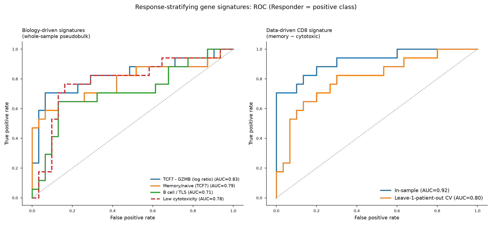

# Which immune cells predict whether melanoma responds to checkpoint immunotherapy?

Single-cell RNA-seq analysis of **16,291 immune cells from 32 melanoma patients** (Sade-Feldman et al., *Cell* 2018, GEO [GSE120575](https://www.ncbi.nlm.nih.gov/geo/query/acc.cgi?acc=GSE120575)) treated with checkpoint immunotherapy (anti-PD-1 / anti-CTLA-4).

**Headline result:** the balance between memory-like and cytotoxic/exhausted CD8 T cells is the strongest predictor of response. A minimal **2-gene ratio (TCF7 − GZMB)** separates responders from non-responders with **AUC 0.83**, and a data-driven CD8 signature reaches **AUC 0.80 under leave-one-patient-out cross-validation** — with zero label leakage in either case.



Responding tumors are also **B-cell-rich and myeloid-poor** (all FDR < 0.05 at the sample level) — reproducing the B-cell/tertiary-lymphoid-structure association reported in the original paper.

## Pipeline

GEO download → QC → Harmony-integrated clustering (32-patient batch correction) → UMAP → canonical-marker cell-type annotation → sample-level composition testing → response-signature discovery with cross-validated ROC/AUC.

25 Leiden clusters were annotated to 7 immune cell types / 9 cell states, dominated by a CD8 T cell continuum from memory → cytotoxic → exhausted.

## Read the full analysis

📄 **[Full report with methods, all figures, and caveats →](report/GSE120575_report.md)**

## Repo contents

```
report/    full write-up (methods, results, honest caveats)
figures/   9 figures: QC, UMAP, marker annotation, composition, ROC
data/      signature AUC table + per-sample signature scores
```

The ~890 MB annotated AnnData (`.h5ad`) object is not included in this repo due to size; the CSVs above contain the derived results needed to reproduce the headline findings.

## Methodological notes

- Sample-level statistical testing throughout (not per-cell) — respects the true unit of biological replication.
- Signature evaluation separates **biology-driven** (label-independent) from **data-driven** (fit on data) signatures, and reports the **leave-one-patient-out cross-validated** AUC as the credible estimate rather than the optimistic in-sample number.
- Smart-seq2 full-length TPM data (not UMI counts) — QC and normalization adapted accordingly.
- All findings are exploratory on a single public cohort; not a validated biomarker.

## Tools

Analysis performed with [Claude Science](https://claude.com/product/claude-science) (scanpy, harmonypy, scikit-learn) — Anthropic's AI workbench for scientific research.
