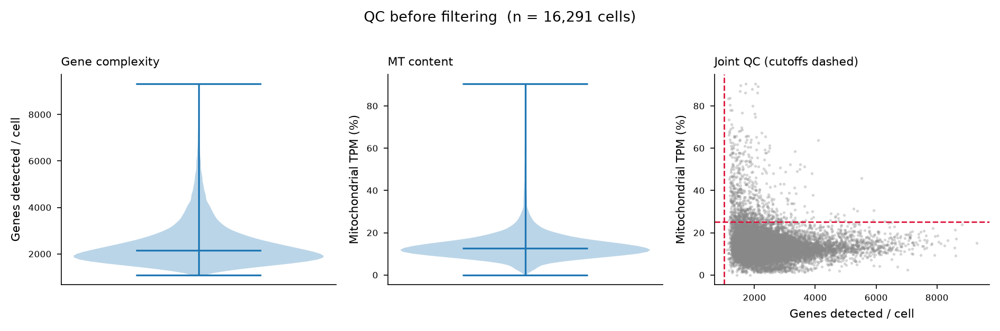
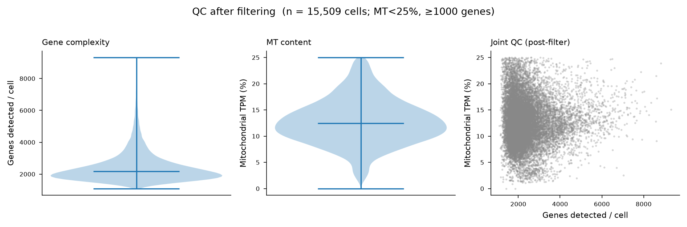
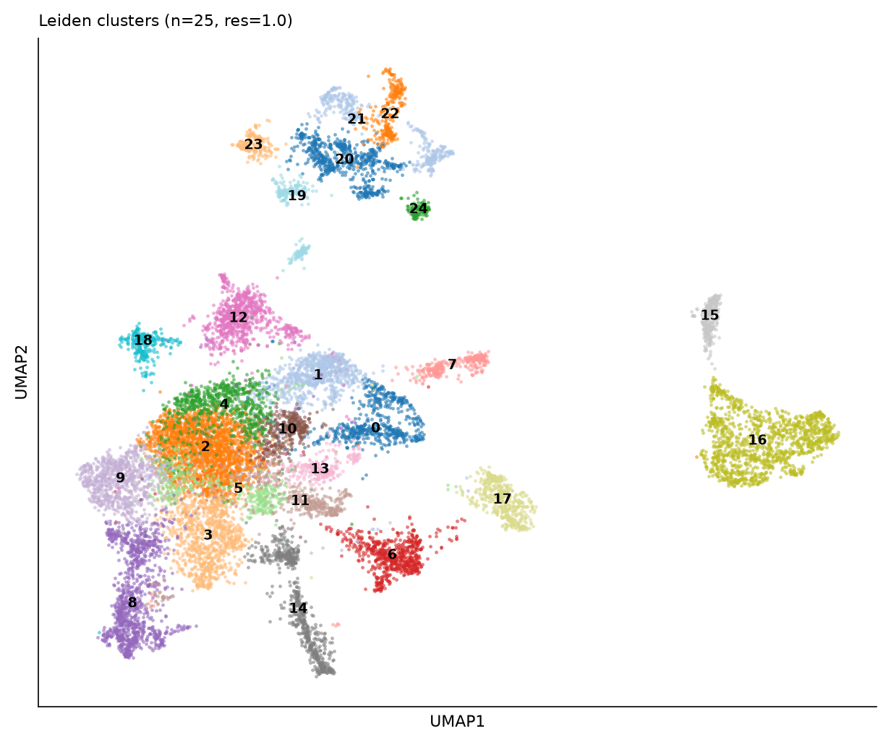
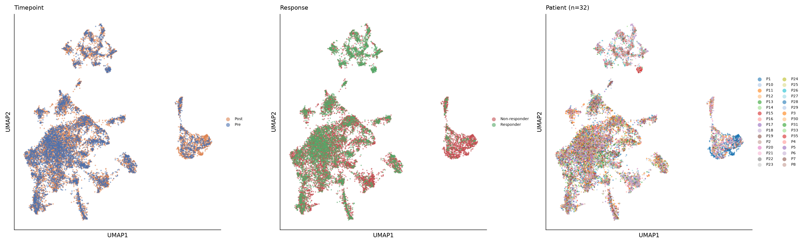
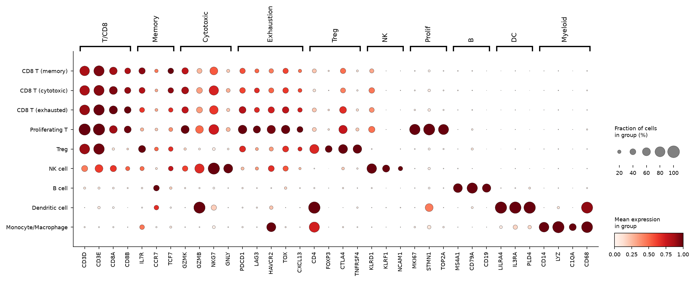
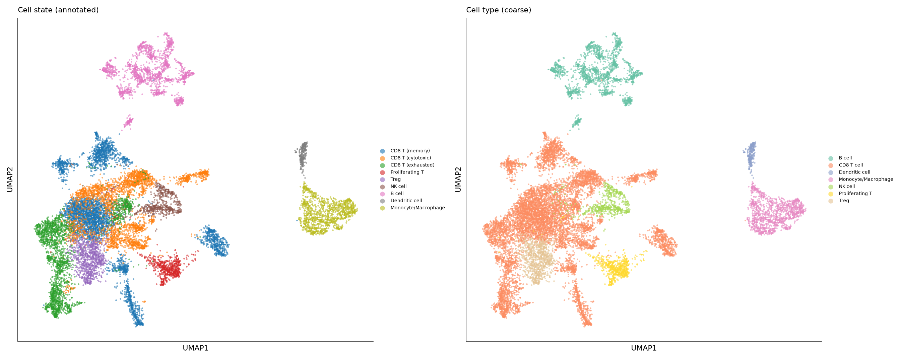
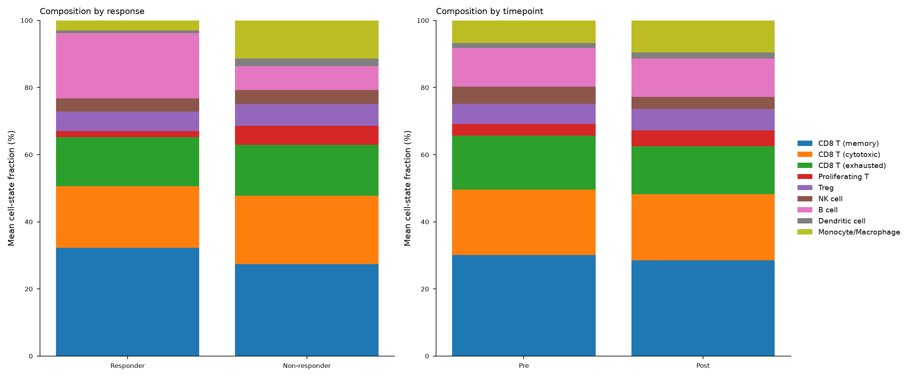
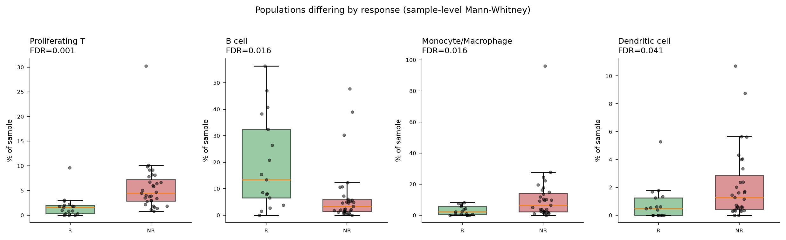

# Single-cell analysis of melanoma checkpoint immunotherapy (GSE120575)

**Dataset:** Sade-Feldman et al., *Cell* 2018 — "Defining T cell states associated with response to checkpoint immunotherapy in melanoma" (GEO **GSE120575**, PMID 30388456).
**Design:** CD45⁺ immune cells from melanoma tumors, sorted and profiled by **Smart-seq2** (full-length, TPM). 48 samples from 32 patients, spanning **Pre** (baseline) and **Post** (on-treatment) timepoints, annotated **Responder** vs **Non-responder** to anti-PD-1 / anti-CTLA-4 (± combination).

---

## 1. Data acquisition & assembly

The processed expression matrix (`..._TPM_GEO.txt.gz`) and per-cell metadata (`..._patient_ID_single_cells.txt.gz`) were downloaded directly from the GEO series FTP. The matrix values are **log2(TPM+1)** (verified: Σ(2ˣ−1) ≈ 1×10⁶ per cell); linear TPM is retained in a separate layer. Metadata was parsed to attach **patient ID**, **timepoint (Pre/Post)**, **response group**, and **therapy** to each cell.

| Property | Value |
|---|---|
| Cells (raw) | 16,291 |
| Cells (post-QC) | **15,509** |
| Detected genes (post-QC) | 45,414 |
| Patients | 32 |
| Samples | 48 (17 Responder, 31 Non-responder samples) |

## 2. Quality control

QC used detected-gene count per cell and mitochondrial TPM fraction (Smart-seq2-appropriate; UMI counts are not available). The matrix was already author-filtered (floor ≈ 1,000 genes/cell). Additional light filtering removed cells with **>25% mitochondrial TPM** or **<1,000 detected genes**, and genes seen in **<3 cells** — trimming 782 cells.

**Before filtering:**

**After filtering:**

## 3. Normalization, integration & clustering

Data were kept on the log2(TPM+1) scale (no library-size renormalization needed for full-length TPM). 2,000 highly variable genes → scaling → PCA (50 PCs). Because the dataset spans 32 patients, **Harmony** batch-correction was applied on the patient covariate before graph construction. Neighbors, UMAP, and Leiden clustering (resolution 1.0) were computed on the integrated embedding, yielding **25 clusters**.

Integration was effective: every cluster draws from 18–32 patients (median 31), and Pre/Post cells are well-mixed, so clusters reflect cell state rather than donor identity.

## 4. Cell-type annotation

Clusters were annotated using a curated canonical immune marker panel (CellGuide canonical markers + established TIL lineage markers), scored per cluster and confirmed by `rank_genes_groups` differential expression. The dotplot below validates each assignment; note the exhaustion gradient (PDCD1/LAG3/HAVCR2/TOX/CXCL13) rising across the CD8 states.

The compartment is dominated by CD8 T cells, consistent with a CD8-focused TIL dataset:

| Cell type | Cells | Notes |
|---|---|---|
| CD8 T cell | 9,831 | split into memory (4,514), cytotoxic (3,037), exhausted (2,280) |
| B cell | 1,853 | MS4A1 / CD79A / CD19 |
| Monocyte/Macrophage | 1,300 | CD14 / LYZ / C1QA / CD68 |
| Treg | 954 | FOXP3 / CTLA4 / TNFRSF4 |
| Proliferating T | 681 | MKI67 / STMN1 / TOP2A |
| NK cell | 607 | GNLY / KLRF1 / KLRD1 |
| Dendritic cell | 283 | LILRA4 / IL3RA / PLD4 (pDC-like) |

Full per-cluster and per-cell-type marker tables were generated during analysis (`markers_per_cluster.csv`, `markers_per_celltype.csv`) — not included in this repo; see `data/` for the retained signature tables.

## 5. Composition changes with treatment and response

Cell-state fractions were computed per sample and tested at the **sample level** (Mann-Whitney, BH-FDR) — respecting the true unit of replication rather than treating individual cells as independent.

**By response** (Responder vs Non-responder), four populations differ significantly:

| Population | Responder % | Non-responder % | FDR | Direction |
|---|---|---|---|---|
| Proliferating T | 1.8 | 5.7 | 0.001 | ↓ in responders |
| B cell | 19.4 | 7.2 | 0.016 | **↑ in responders** |
| Monocyte/Macrophage | 3.0 | 11.4 | 0.016 | ↓ in responders |
| Dendritic cell | 0.8 | 2.2 | 0.041 | ↓ in responders |

Responding tumors are **B-cell-rich** and **myeloid-poor**, with fewer proliferating T cells — reproducing the paper's association of B-cell/TLS abundance and low myeloid infiltration with favorable response. **By timepoint** (Pre vs Post), no population changed significantly after FDR correction (exhausted CD8 and NK trended down on-treatment). Full composition test tables were generated during analysis; the per-sample scores retained here are in `data/`.

## 6. Response-stratifying gene signatures

Two complementary signature classes were evaluated on **sample pseudobulk** (Responder = positive class):

- **Biology-driven** signatures are defined independently of the response labels (no leakage), scored on whole-sample pseudobulk.
- **Data-driven** signature is derived from CD8 T-cell differential expression between R/NR. To avoid circularity, it is evaluated both in-sample (optimistic) and under **leave-one-patient-out cross-validation** (honest).

The data-driven CD8 signature recovers the paper's core axis directly: responder CD8 cells are enriched for **memory/naive markers** (TCF7, CCR7, IL7R, SELL, GPR183), non-responder CD8 cells for **cytotoxic/dysfunction markers** (GZMB, PRF1, NKG7, GZMA).

| Signature | Type | AUC | Evaluation |
|---|---|---|---|
| Data-driven CD8 (memory − cytotoxic) | data-driven | 0.922 | in-sample (optimistic) |
| **TCF7 − GZMB (2-gene log ratio)** | biology-driven | **0.827** | whole-sample pseudobulk |
| Data-driven CD8 (memory − cytotoxic) | data-driven | **0.804** | **leave-one-patient-out CV** |
| Memory/naive (TCF7 program) | biology-driven | 0.786 | whole-sample pseudobulk |
| B cell / TLS | biology-driven | 0.713 | whole-sample pseudobulk |
| Low cytotoxicity | biology-driven | 0.784 | whole-sample pseudobulk (reversed) |
| Low exhaustion | biology-driven | 0.750 | whole-sample pseudobulk (reversed) |

The data-driven signature's drop from 0.922 (in-sample) to **0.804 (LOPO-CV)** is the expected overfitting optimism — 0.804 is the credible estimate. Strikingly, a **2-gene TCF7−GZMB ratio** achieves AUC 0.827 with zero label leakage, confirming that the memory-vs-cytotoxic balance of intratumoral CD8 T cells is the dominant response correlate. Full tables: [signature_auc_table.csv](../data/signature_auc_table.csv), [signature_scores_per_sample.csv](../data/signature_scores_per_sample.csv).

## 7. Summary

1. **16,291 → 15,509** CD45⁺ immune cells (32 patients, 48 samples) were QC-filtered, Harmony-integrated on patient, and clustered into 25 Leiden clusters annotated to 7 immune cell types / 9 cell states, dominated by CD8 T cells across a memory → cytotoxic → exhausted continuum.
2. **Responding tumors are B-cell-rich and myeloid/proliferating-T-poor** (all FDR < 0.05 at sample level); no population shifted significantly Pre→Post after correction.
3. The **memory-vs-cytotoxic balance of CD8 T cells** stratifies responders from non-responders: a data-driven CD8 signature reaches **AUC 0.80 under leave-one-patient-out CV**, and a minimal **TCF7−GZMB ratio reaches AUC 0.83**.

### Caveats
- Smart-seq2 full-length TPM (not UMI); QC thresholds and normalization adapted accordingly.
- This is a CD8-skewed CD45⁺ dataset — CD4 conventional helper cells are sparse, and rare populations (mast cells, plasma cells as a distinct cluster) were not resolved at this resolution.
- Signature AUCs are **exploratory** on a single cohort; the cross-validated estimate is the appropriate one to quote, and external validation would be required before any biomarker claim.

### Key artifacts
- `gse120575_annotated.h5ad` — fully annotated AnnData (patient, timepoint, response, leiden, cell_type, cell_state, marker scores). Not included in this repo (≈890 MB); see the repository README for how to obtain it.
- Figures: QC (before/after), UMAPs (cluster/metadata/cell-type), marker dotplot, composition (stacked + boxplots), signature ROC — all in `../figures/`.
- Tables: signature AUC & per-sample scores — in `../data/`.

*Methods: scanpy 1.11, harmonypy, scikit-learn. Canonical markers cross-referenced via CellGuide (CELLxGENE). Analysis performed using [Claude Science](https://claude.com/product/claude-science).*
